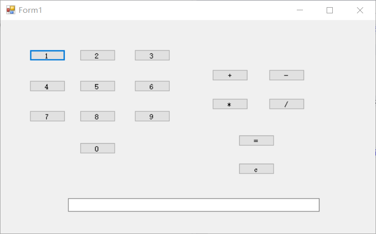

# 基于c#的简易计算器
## 代码部分
```csharp
using System;
using System.Collections.Generic;
using System.ComponentModel;
using System.Data;
using System.Drawing;
using System.Linq;
using System.Text;
using System.Threading.Tasks;
using System.Windows.Forms;

namespace WindowsFormsApp6
{
    public partial class Form1 : Form
    {
        double a = 0;

        double b = 0;

        bool c = false;

        string d;
        public Form1()
        {
            InitializeComponent();
        }

        private void button2_Click(object sender, EventArgs e)
        {
            if (c == true)

            {

                textBox1.Text = "";

                c = false;

            }

            textBox1.Text += "2";

        }

        private void button4_Click(object sender, EventArgs e)
        {
            if (c == true)

            {

                textBox1.Text = "";

                c = false;

            }

            textBox1.Text += "4";
        }

        private void button5_Click(object sender, EventArgs e)
        {
            if (c == true)

            {

                textBox1.Text = "";

                c = false;

            }

            textBox1.Text += "5";
        }

        private void button1_Click(object sender, EventArgs e)
        {
            if (c == true)

            {

                textBox1.Text = "";

                c = false;

            }

            textBox1.Text += "1";

        }

        private void button3_Click(object sender, EventArgs e)
        {
            if (c == true)

            {

                textBox1.Text = "";

                c = false;

            }

            textBox1.Text += "3";
        }

        private void button6_Click(object sender, EventArgs e)
        {
            if (c == true)

            {

                textBox1.Text = "";

                c = false;

            }

            textBox1.Text += "6";
        }

        private void button7_Click(object sender, EventArgs e)
        {
            if (c == true)

            {

                textBox1.Text = "";

                c = false;

            }

            textBox1.Text += "7";
        }

        private void button8_Click(object sender, EventArgs e)
        {
            if (c == true)

            {

                textBox1.Text = "";

                c = false;

            }

            textBox1.Text += "8";
        }

        private void button9_Click(object sender, EventArgs e)
        {
            if (c == true)

            {

                textBox1.Text = "";

                c = false;

            }

            textBox1.Text += "9";
        }

        private void button10_Click(object sender, EventArgs e)
        {
            if (c == true)

            {

                textBox1.Text = "";

                c = false;

            }

            textBox1.Text += "0";

            if (d == "/")

            {

                textBox1.Clear();

                MessageBox.Show("除数不能为零", "错误提示", MessageBoxButtons.OK, MessageBoxIcon.Warning);
            }
        }

        private void button11_Click(object sender, EventArgs e)
        {
            c = true;

            b = double.Parse(textBox1.Text);

            d = "+";
        }

        private void button12_Click(object sender, EventArgs e)
        {
            c = true;

            b = double.Parse(textBox1.Text);

            d = "-";
        }

        private void button13_Click(object sender, EventArgs e)
        {
            c = true;

            b = double.Parse(textBox1.Text);

            d = "*";
        }

        private void button14_Click(object sender, EventArgs e)
        {
            c = true;

            b = double.Parse(textBox1.Text);

            d = "/";
        }

        private void button16_Click(object sender, EventArgs e)
        {
            switch (d)

            {

                case "+": a = b + double.Parse(textBox1.Text); break;

                case "-": a = b - double.Parse(textBox1.Text); break;

                case "*": a = b * double.Parse(textBox1.Text); break;

                case "/": a = b / double.Parse(textBox1.Text); break;
            }
            textBox1.Text = a + "";

            c = true;
        }

        private void button15_Click(object sender, EventArgs e)
        {
            textBox1.Text = "0";
        }

        private void Form1_Load(object sender, EventArgs e)
        {

        }
    }
}
```
## 代码的简要分析
* button1~10代表1~0的十个数字 button11~14代表加减乘除四个运算符
* button16代表“=”运算符，运用switch语句和布尔数c进行运算
* button15代表清零运算
## 成品界面

