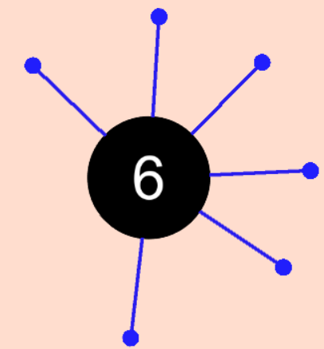
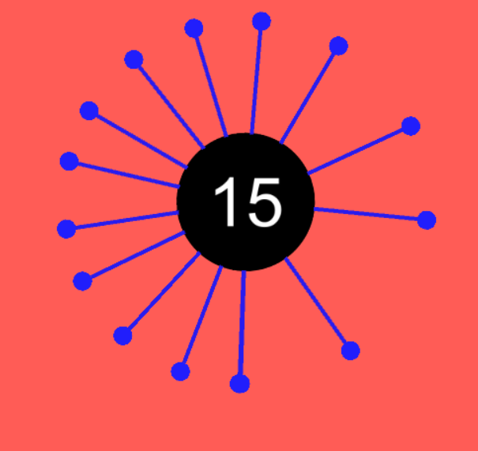

# Unity小游戏--见缝插针
## 游戏概况
---
游戏画面非常的简洁，背景中央放置着一个不断旋转的太阳状的球体，周边网状似的放射连接着许多小球。游戏的玩法非常简单，当黑色的球体不停转动的时候，大家只需通过点击鼠标左键，让屏幕下方带有数字的小球粘到大球上，直的所有球都粘完即可。
## 游戏实现
---
1. 中心球体的**自转**  
通过Transform类的rotate函数控制中心球体旋转
```C
public float speed = 90;
	void Update () {
        transform.Rotate(new Vector3(0, 0, -speed * Time.deltaTime));
	}
    // 正负号使球体顺时针旋转
    // Time.deltaTime帧间补偿使旋转连贯
```
---
2.  发射的小球的生成与移动  
在Unity中通过创建空物体以定义小球的生成位置与起始位置
```C
 if (Input.GetMouseButtonDown(0))
        {
            currentPin.StartFly();
            SpawnPin();
        }
    }
    void SpawnPin()
    {
        currentPin = GameObject.Instantiate(pinPrefab, spawnPoint.position, pinPrefab.transform.rotation).GetComponent<Pin>();
        // GameObject.Instantiate 实现针的初始化
    }
void Update () {
        if (isFly == false)
        {
            if (isReach == false)
            {
                transform.position = Vector3.MoveTowards(transform.position, startPoint.position, speed * Time.deltaTime);
                if (Vector3.Distance(transform.position, startPoint.position) < 0.05f)
                {
                    isReach = true;
                }
                //通过MoveTowards控制针向起始点移动，用Distance比较两者距离，并通过if语句判断是否到达
            }
        }
        else
        {
            transform.position = Vector3.MoveTowards(transform.position, targetCirclePos, speed * Time.deltaTime);
            if(Vector3.Distance( transform.position,targetCirclePos) < 0.05f)
            {
                transform.position = targetCirclePos;
                transform.parent = circle;
                isFly = false;
            }//transform.parent控制发射到大球上的小球随着大球一起旋转
        }
	}

    public void StartFly()
    {
        isFly = true;
        isReach = true;
    }
}
```
---
3.   游戏失败的判断  
通过在生成的小球上面附加刚体属性以及触发器判断两个独立的小球是否碰撞，在小球上添加标签，通过**标签的识别**判别游戏是否失败
```C

    private void OnTriggerEnter2D(Collider2D collision)
    {
        if (collision.tag == "PinHead")
        {
            GameObject.Find("GameManager").GetComponent<GameManager>().GameOver();
        }
    }
    //判断到另一小球的触发器标签后，用GameObject.Find找到游戏管理器并通过GetComponent获取其上代码中的Gameover函数。
```
游戏失败后大球停止旋转，小球生成与移动停止。    
通过添加bool变量isGameOver进行判断
```C
private bool isGameOver = false;
public void GameOver()
    {
        if (isGameOver) return;
        GameObject.Find("Circle").GetComponent<RotateSelf>().enabled = false;
        isGameOver = true;
    }//同样通过GameObject.Find游戏元件Circle获取使控制其旋转的代码RotateSelf禁止来停止小球的旋转
```
---
4.  游戏分数的显示  
通过建立UI的文本框来显示分数
```C
using UnityEngine.UI;
//因为涉及UI的运用使用新的库
private int score = 0;
public Text scoreText;
 private void Update()
    {
        if (isGameOver) return;
        if (Input.GetMouseButtonDown(0))
        {
            score++;
            scoreText.text = score.ToString();
        }
    }
    //在游戏未失败前提下，通过每次鼠标的点击控制分数的增加 ToString会以文本形式返回字符串
```


---
5.   游戏失败的显示  
预设失败后，游戏场景变**大**，背景变**红**。
```C
using UnityEngine.SceneManagement;
//运用库控制场景的变化
public void GameOver()
    {
        if (isGameOver) return;
        GameObject.Find("Circle").GetComponent<RotateSelf>().enabled = false;
        StartCoroutine(GameOverAnimation());
        //启用协同程序
        isGameOver = true;
    }
    IEnumerator GameOverAnimation()
    {
        while (true)
        {
            mainCamera.backgroundColor = Color.Lerp(mainCamera.backgroundColor, Color.red, speed * Time.deltaTime);
            //用Color.Lerp控制背景颜色从原有颜色变为红色
            mainCamera.orthographicSize = Mathf.Lerp(mainCamera.orthographicSize, 4, speed * Time.deltaTime);
            通过Mathf.Lerp控制背景大小变大
            if( Mathf.Abs( mainCamera.orthographicSize-4 )<0.01f)
            {
                break;
            }
            yield return 0;
        }
        yield return new WaitForSeconds(0.2f);
        SceneManager.LoadScene(SceneManager.GetActiveScene().buildIndex);
        //失败界面显示后调用原界面初始游戏
    }
```     



