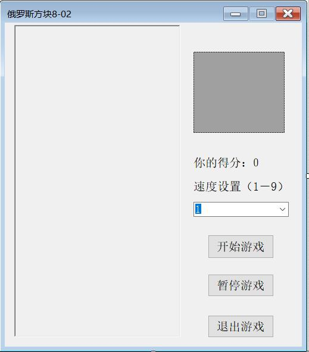
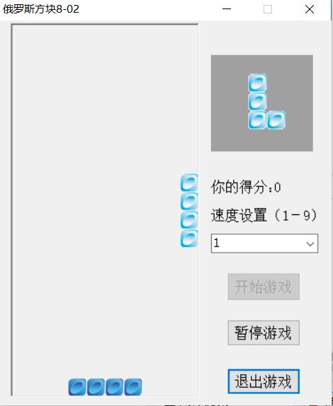

# Readme of c# Program Teris
## 电气1607班向朝阳暑假demo说明文档

    demo主要应用了 Gdi+、计时器控件等技术，实现了一个功能简洁的俄罗斯方块程序，系统具有自定义方块背景图形、显示级别、得分、消去行数等特点。在后续的设计思路中还将加入道具系统和特殊动画效果以及语音效果，使该俄罗斯方块程序有创新之处

---
**teris 的实现原理**
> 俄罗斯方块是一个老少皆宜的游戏，其开发方法主要是利用Gdi+绘图及Timer定时器技术实现。游戏开发 与一般应用程序开发不同，游戏的特点是根据用户的输入来控制游戏的画面移动和游戏的进程，所以需要在一 定的时间间隔内对游戏状态，包括画面进行刷新，以便达到动画效果。 整个游戏由一个Timer定时器控件控制，它是整个游戏的关键。在游戏初始化时对Timer定时器控件进行初 始化，设定定时器的事件触发时间间隔及所触发的事件。Timer定时器所触发的事件为Tick，Tick方法是本游戏 的关键，在该方法中，将当前俄罗斯方块向下移动，并判断方块是否到达了游戏区域的最底端。如果到达了最 底端，则创建下一下方块，并判断是否有填充满的行并消去填充满的行。如果当前方块到达游戏区域的最顶端， 则游戏结束。 在程序中，用户可通过指定的快捷键对当前方块进行控制（包括左移、右移、旋转、到底），其中旋转比 较复杂，如果当前方块位于游戏区域边缘时，可能无法旋转，所以判断方块能否旋转是本程序一个重要的技术。 本程序中采用一个二维数组来表示游戏区域，二维数组中设置为true的单元，表示游戏区域中该位置已经有方 块，当旋转当前方块时，首先判断旋转以后的方块位置与游戏区域的边缘是否相交，或与值为true的单元是否 相交，如果相交，则当前方块不能旋转，如未相交，则可对当前方块进行旋转
----
**设计思路**
* 创建二维数组，以矩阵方式存储俄罗斯方块数据 
* 采用 Timer 控件定时刷新游戏
* 采用 PictureBox 控件显示游戏区域
* 采用 Gdi+绘制游戏图形
---
**Program.cs由Block.cs和Game.cs组成，下面分别贴出代码**
 
 *Block.cs*
 ```c #
 using System;
using System.Drawing;

namespace 俄罗斯方块
{
    public class Block
    {
        private readonly int ID; //方块部件的ID
        private short height;
        private short left;
        public int[,] shape; //存储方块部件的形状，０为空白，１为有砖块
        private short top;
        private short width;

        public Block() //构造函数
        {
            Random randomGenerator = new Random();
            int randomBlock = randomGenerator.Next(1, 5); //产生1—4的数
            ID = randomBlock;
            switch (ID)
            {
                case 1: //横条形
                    Width = 4;
                    Height = 1;
                    Top = 0;
                    Left = 3;
                    shape = new int[Width,Height];
                    shape[0, 0] = 1;
                    shape[1, 0] = 1;
                    shape[2, 0] = 1;
                    shape[3, 0] = 1;
                    break;
                case 2: //正方形
                    Width = 2;
                    Height = 2;
                    Top = 0;
                    Left = 4;
                    // Creates the new shape for this block.
                    shape = new int[Width,Height];
                    shape[0, 0] = 1;
                    shape[0, 1] = 1;
                    shape[1, 0] = 1;
                    shape[1, 1] = 1;
                    break;
                case 3: //Ｔ形
                    Width = 3;
                    Height = 3;
                    Top = 0;
                    Left = 4;
                    // Creates the new shape for this block.
                    shape = new int[Width,Height];
                    shape[0, 0] = 1;
                    shape[1, 0] = 1;
                    shape[2, 0] = 1;
                    shape[1, 1] = 1;
                    shape[1, 2] = 1;
                    break;
                case 4: //L形
                    Width = 2;
                    Height = 3;
                    Top = 0;
                    Left = 4;
                    // Creates the new shape for this block.
                    shape = new int[Width,Height];
                    shape[0, 0] = 1;
                    shape[0, 1] = 1;
                    shape[0, 2] = 1;
                    shape[1, 2] = 1;
                    break;
            }
        }

        public short Width //Width属性
        {
            get { return width; }
            set { width = value; }
        }

        public short Height //Height属性
        {
            get { return height; }
            set { height = value; }
        }

        public short Top //Top属性
        {
            get { return top; }
            set { top = value; }
        }

        public short Left //Left属性
        {
            get { return left; }
            set { left = value; }
        }

        public void Draw(Graphics g)
        {
            Image brickImage = Image.FromFile("image/block0.gif");
            for (int i = 0; i < Width; i++)
            {
                for (int j = 0; j < Height; j++)
                {
                    if (shape[i, j] == 1) //黑色格子
                    {
                        //得到绘制这个格子的在游戏面板中的矩形区域
                        Rectangle rect = new Rectangle((Left + i)*Game.BlockImageWidth, (Top + j)*Game.BlockImageHeight,
                                                       Game.BlockImageWidth, Game.BlockImageHeight);
                        g.DrawImage(brickImage, rect);
                    }
                }
            }
        }
    }

//class Block
}
```
---
*Game.cs*
```c #
using System.Drawing;

//add

namespace 俄罗斯方块
{
    internal class Game
    {
        public const int BlockImageWidth = 21; //方砖中每个小方格的大小
        public const int BlockImageHeight = 21;
        public const int PlayingFieldWidth = 10; //游戏面板大小
        public const int PlayingFieldHeight = 20;
        private readonly int[,] pile; //存储在游戏面板中的所有方砖;
        private Block currentBlock; //当前的俄罗斯方块
        public int lines = 0;
        private Block nextBlock; //下一个的俄罗斯方块
        public bool over = false; //游戏是否结束
        public int score = 0;

        public Game() //Game类构造函数
        {
            pile = new int[PlayingFieldWidth,PlayingFieldHeight];
            ClearPile();
            CreateNewBlock(); //产生新的俄罗斯方块
        }

        private void ClearPile() //清空游戏面板中的所有方砖
        {
            for (int i = 0; i < PlayingFieldWidth; i++)
            {
                for (int j = 0; j < PlayingFieldHeight; j++)
                {
                    pile[i, j] = 0;
                }
            }
        }

        private void CreateNewBlock() //产生新的俄罗斯方块
        {
            if (nextBlock != null)
            {
                currentBlock = nextBlock;
            }
            else
            {
                currentBlock = new Block();
            }
            nextBlock = new Block();
        }

        public void DrawPile(Graphics g)
        {
            Image brickImage = Image.FromFile("image/block1.gif"); //方砖的图形
            for (int i = 0; i < PlayingFieldWidth; i++)
            {
                for (int j = 0; j < PlayingFieldHeight; j++)
                {
                    if (pile[i, j] == 1)
                    {
                        Rectangle rect = new Rectangle(i*BlockImageWidth, j*BlockImageHeight, BlockImageWidth,
                                                       BlockImageHeight); //(j - 1)
                        g.DrawImage(brickImage, rect);
                    }
                }
            }
        }

        public void DrawCurrentBlock(Graphics g)
        {
            if (currentBlock != null) //检查当前块是否为空
            {
                currentBlock.Draw(g);
            }
        }

        public void DrawNextBlock(Graphics drawingSurface)
        {
            if (nextBlock != null)
            {
                short currentLeft = nextBlock.Left;
                short currentTop = nextBlock.Top;
                nextBlock.Left = (short) ((6 - nextBlock.Width)/2);
                nextBlock.Top = (short) ((6 - nextBlock.Height)/2);
                nextBlock.Draw(drawingSurface);
                nextBlock.Left = currentLeft;
                nextBlock.Top = currentTop;
            }
        }

        private void MoveBlockToPile() //固定到游戏面板上
        {
            for (int i = 0; i < currentBlock.Width; i++)
            {
                for (int j = 0; j < currentBlock.Height; j++)
                {
                    int fx, fy;
                    fx = currentBlock.Left + i;
                    fy = currentBlock.Top + j;
                    if (currentBlock.shape[i, j] == 1)
                    {
                        pile[fx, fy] = 1;
                    }
                }
            }
            CheckForLines();
            if (CheckForGameOver()) //检查游戏是否结束
                over = true;
        }

        public bool DownCurrentBlock()
        {
            bool hit = false;
            currentBlock.Top++;
            if ((currentBlock.Top + currentBlock.Height) > PlayingFieldHeight)
            {
                hit = true; //当前块触游戏面板底
            }
            else //检查是否接触到下一行其他已落方块
            {
                for (int i = 0; i < currentBlock.Width; i++)
                {
                    for (int j = 0; j < currentBlock.Height; j++)
                    {
                        int fx, fy;
                        fx = currentBlock.Left + i;
                        fy = currentBlock.Top + j;
                        if ((currentBlock.shape[i, j] == 1) && (pile[fx, fy] == 1)) //(fy + 1)
                        {
                            hit = true;
                        }
                    }
                }
            }
            if (hit) //触到其他已落方块或游戏面板底
            {
                currentBlock.Top--;
                MoveBlockToPile(); //固定到游戏面板上            　　
                CreateNewBlock(); //产生新的俄罗斯方块
            }
            return hit;
        }

        public void RotateCurrentBlock() //旋转方块
        {
            bool canRotate = true;
            short newWidth = 0;
            short newHeight = 0;
            int[,] newShape;
            newWidth = currentBlock.Height;
            newHeight = currentBlock.Width;
            newShape = new int[newWidth,newHeight];
            int x, y;
            if (((currentBlock.Left + newWidth) <= PlayingFieldWidth)
                && ((currentBlock.Top + newHeight) < PlayingFieldHeight))
            {
                for (int i = 0; i < currentBlock.Width; i++)
                {
                    for (int j = 0; j < currentBlock.Height; j++)
                    {
                        x = ((currentBlock.Height - 1) - j);
                        y = i;
                        newShape[x, y] = currentBlock.shape[i, j];
                        if (newShape[x, y] == 1 && pile[x + currentBlock.Left, y + currentBlock.Top] == 1)
                        {
                            canRotate = false;
                            return; //不能旋转 }
                        }
                    }
                }
                if (canRotate)
                {
                    currentBlock.Width = newWidth;
                    currentBlock.Height = newHeight;
                    currentBlock.shape = newShape;
                }
            }
        }

        public void MoveCurrentBlockSide(bool left) //左右移动
        {
            bool canMove = true;
            if (left) //左移动
            {
                if (currentBlock.Left > 0)
                {
                    for (int i = 0; i < currentBlock.Width; i++)
                    {
                        for (int j = 0; j < currentBlock.Height; j++)
                        {
                            int fx, fy;
                            fx = currentBlock.Left + i;
                            fy = (currentBlock.Top + 1) + j;
                            if ((currentBlock.shape[i, j] == 1) && (pile[(fx - 1), fy] == 1))
                            {
                                canMove = false;
                            }
                        }
                    }
                    if (canMove)
                    {
                        currentBlock.Left--;
                    }
                }
            }
            else //右移动
            {
                if ((currentBlock.Left + currentBlock.Width) < PlayingFieldWidth)
                {
                    for (int i = 0; i < currentBlock.Width; i++)
                    {
                        for (int j = 0; j < currentBlock.Height; j++)
                        {
                            int fx, fy;
                            fx = currentBlock.Left + i;
                            fy = (currentBlock.Top + 1) + j;
                            if ((currentBlock.shape[i, j] == 1) && (pile[(fx + 1), fy] == 1))
                            {
                                canMove = false;
                            }
                        }
                    }
                    if (canMove)
                    {
                        currentBlock.Left++;
                    }
                }
            }
        }

        private int CheckForLines() //检查是否满行并消去
        {
            int numLines = 0;
            int[] completeLines = new int[PlayingFieldHeight];
            for (int j = PlayingFieldHeight - 1; j > 0; j--) 
            {
                bool fullLine = true;
                for (int i = 0; i < PlayingFieldWidth; i++)
                {
                    if (pile[i, j] == 0)
                    {
                        fullLine = false;
                        break;
                    }
                }
                if (fullLine)
                {
                    numLines++;
                    completeLines[numLines] = j;
                }
            }

            if (numLines > 0)
            {
                for (int i = 1; i <= numLines; i++)
                {
                    ClearLine((completeLines[i] + (i - 1)));
                }
                score += 5*(numLines*(numLines + 1));
                lines += numLines;
            }
            return numLines;
        }

        private void ClearLine(int lineNumber)
        {
            for (int j = lineNumber; j > 0; j--)
            {
                for (int i = 0; i < PlayingFieldWidth; i++)
                {
                    pile[i, j] = pile[i, (j - 1)];
                }
            }
            for (int i = 0; i < PlayingFieldWidth; i++)
            {
                pile[i, 0] = 0;
            }
        }

        public bool CheckForGameOver() //检查游戏是否结束
        {
            if (currentBlock.Top == 0)
                return true;
            else
                return false;
        }
    }
}
```
---
**下面为界面设计与具体实现效果**



---


> 该程序仍较为简陋，下一步实现目标就是要加入交互界面实现创新

*via xiangzhaoyang*